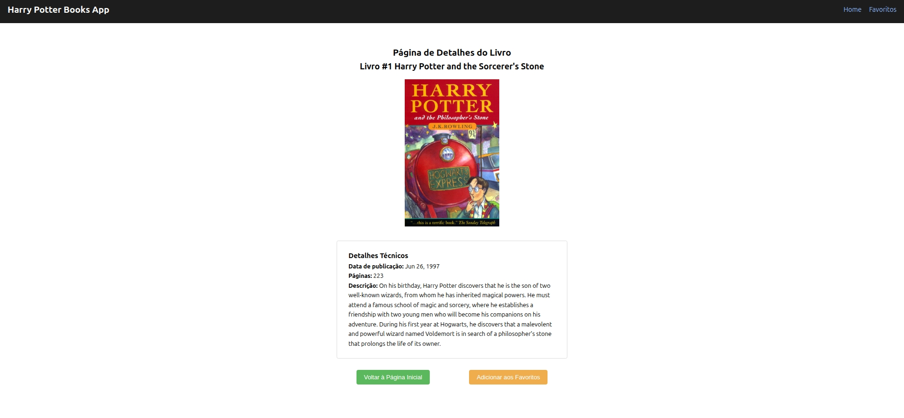
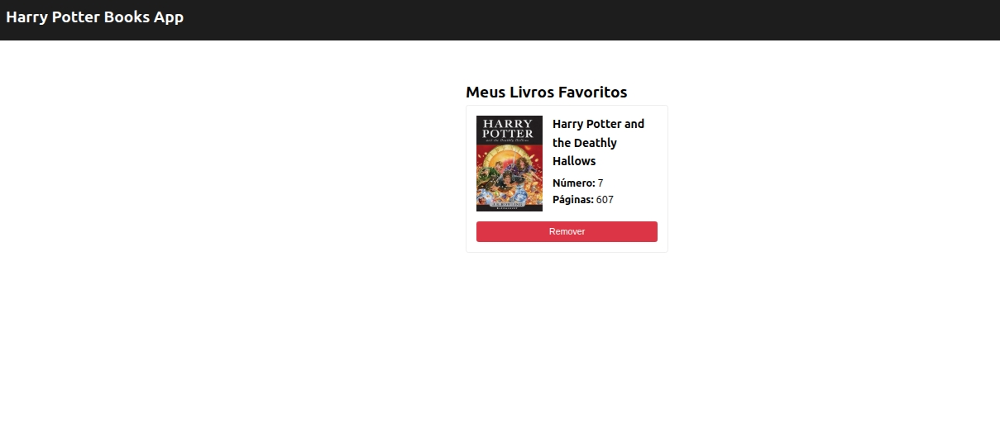

# 🧙 react_vercel_app

---

## 📚 1. Sobre o Projeto

Este projeto é uma atividade prática da disciplina de Frontend Frameworks, desenvolvida utilizando **React** com **Vite**.

O objetivo principal é demonstrar o consumo de uma API REST pública (Harry Potter API) e a implementação de uma Single Page Application (SPA) com roteamento entre 3 telas obrigatórias, além da persistência de dados utilizando o `localStorage`.

### Requisitos Atendidos

* **Ambiente:** Node.js (20.19.*) e Vite (7.* - Template React).
* **API:** Consumo da Harry Potter API (`potterapi-fedeperin.vercel.app`).
* **Telas Obrigatórias:** Home, Detalhes do Livro, Favoritos.
* **Persistência:** Lista de Favoritos salva no `localStorage` do navegador.
* **Publicação:** Deployed no Vercel.
* **Responsividade:** Layout responsivo, centralizado e adaptado para dispositivos móveis e desktop.

---

## 🚀 2. Instalação e Execução Local

Siga os passos abaixo para clonar e executar a aplicação em seu ambiente de desenvolvimento.

### Pré-requisitos

* Node.js na versão **20.19.x** (Recomendado usar **NVM** para gerenciar a versão).
* Um gerenciador de pacotes: `npm`, `yarn` ou `pnpm`.

### Passos

1.  **Clone o Repositório:**
    ```bash
    git clone [https://github.com/SEU-USUARIO/react_vercel_app.git](https://github.com/SEU-USUARIO/react_vercel_app.git)
    cd react_vercel_app
    ```

2.  **Instale as Dependências:**
    ```bash
    npm install
    # ou yarn install / pnpm install
    ```

3.  **Inicie o Servidor de Desenvolvimento:**
    ```bash
    npm run dev
    ```

A aplicação estará acessível em `http://localhost:5173/` (ou a porta indicada pelo Vite).

---

## 🗺️ 3. Estrutura e Rotas da Aplicação

O projeto segue a arquitetura de *Container/Componentes/Utils* e utiliza o **React Router DOM** para gerenciar as 3 telas obrigatórias.

| Rota (URL) | Tela Obrigatória | Funcionalidade |
| :--- | :--- | :--- |
| `/` | **Tela 1: Página Inicial (Home)** | Busca um **novo** livro aleatório na API. Ao clicar na capa, navega para os detalhes. |
| `/details/:number` | **Tela 2: Detalhes do Livro** | Exibe capa, título completo e dados técnicos. Possui lógica de *fallback* para buscar os dados na API caso a página seja recarregada (`F5`). |
| `/favorites` | **Tela 3: Página de Favoritos** | Recupera, exibe e permite remover a lista de livros favoritos salvos no `localStorage`. |

---

## 📸 4. Screenshots (Prints de Tela)

**Atenção:** Certifique-se de que os arquivos de imagem estão na pasta `assets/` e foram enviados para o GitHub.

### 4.1. Tela 1: Página Inicial (Home)


### 4.2. Tela 2: Página de Detalhes do Livro



### 4.3. Tela 3: Página de Favoritos



---

## 🔗 5. Link para Avaliação

1.  **Repositório GitHub (Este Link):**
    `https://github.com/AlcidesNeto32/react_vercel_app?classId=27debfed-e075-469b-83e8-33d7ecd778c9&assignmentId=0d90bb5f-de5a-42b1-bf34-ddb9fb85141a&submissionId=91793bb1-c72b-411f-cfd8-1e7a3ae09445`

---
